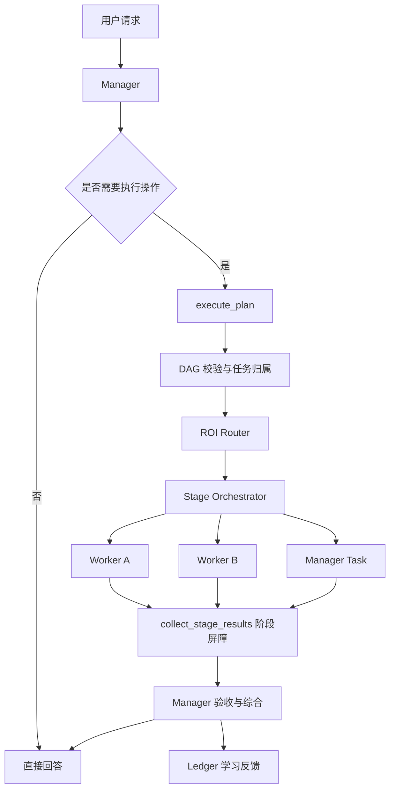

# HengFlow v2（衡流）

> 成本感知、可学习、可独立安装的多模型 Multi-Agent Runtime。

HengFlow 将复杂任务拆分为一个由 **Manager** 负责决策、多个只读 **Worker** 并行执行的任务图。系统不会简单地把所有工作交给最强或最贵的模型，而是根据任务类型、质量、价格、失败率、延迟、额度压力和返工概率进行路由，并通过历史执行结果持续调整策略。

仓库地址：<https://github.com/hukunhukun/hengflow_v2>

## 为什么使用 HengFlow

传统单 Agent 通常让同一个模型完成规划、检索、编码和总结，容易产生以下问题：

- 简单任务也使用高成本模型；
- 大型仓库分析无法充分并行；
- 子任务写入权限不清晰；
- 多模型选择缺少可解释依据；
- 调用结果没有沉淀为后续路由经验。

HengFlow 的设计目标是：

1. **Manager 对最终结果负责**：规划、写入、高风险操作、验收和最终回答始终由 Manager 控制。
2. **Worker 专注只读执行**：Worker 在隔离会话中完成搜索、分析、研究和代码审查。
3. **任务图并发而非盲目并发**：DAG 明确依赖关系，只有 ready 节点才能启动。
4. **以完整路径成本进行路由**：同时计算 Worker 成本、编排成本和预期返工成本。
5. **从运行结果中学习**：按“模型 × 任务类型 × 复杂度”累计质量、失败率、延迟和成本统计。

## 核心能力

- 独立 CLI 与 TUI，安装 HengFlow 后即可运行；
- Manager 和 Worker 均可配置，不绑定单一模型；
- 从已认证模型中选择明确配置的 Worker 池；
- 支持 `simple`、`research`、`coding`、`long-context`、`synthesis` 等任务类型；
- DAG 原子校验、依赖调度、并发控制、失败传播和取消；
- Worker 只读隔离，写入和高风险任务自动保留给 Manager；
- ROI 路由综合质量、成本、失败率、延迟、额度压力与上下文开销；
- 单次有界降级，避免失败后无限重试；
- Task Board 实时显示任务、模型、工具、耗时、Token、成本和输出尾部；
- SQLite 持久化调用、路由、额度和模型表现数据；
- v3：跨时间预算分配——虚拟队列（Q_t）+ 影子价格（λ_t）路由、全路径硬可行性降级链、launch 时懒重路由、分解经济学门禁与预测校准（见 `docs/v3-budget.md`）；
- 支持交互模式与适合脚本/CI 的 Print 模式。

## Multi-Agent 架构



### Manager

Manager 是当前会话的责任主体：

- 理解用户意图；
- 将行动型请求拆成最多若干个 DAG 节点；
- 判断任务风险、是否写入及依赖关系；
- 执行所有写操作和高风险操作；
- 跟踪 Manager 自己负责的节点状态；
- 在阶段屏障后验收 Worker 结果；
- 必要时修正、补做或拒绝低质量结果；
- 输出最终回答。

行动型请求存在规划门禁：首个工具调用必须是 `execute_plan`，未经规划不能直接写文件或执行其他高影响操作。

### Worker

Worker 是独立的短生命周期 Agent Session：

- 从 Manager 的有效会话上下文分叉；
- 默认仅拥有 `read`、`grep`、`find`、`ls`；
- 只有低风险任务在显式允许时可以使用只读 shell 检查；
- 不修改文件，不改变外部状态；
- 不承担最终综合；
- 失败时最多沿降级链重试一次。

Manager 使用的模型不会同时进入 Worker 池，避免同一模型重复承担两个角色。

### 四个编排工具

| 工具 | 作用 |
| --- | --- |
| `execute_plan` | 原子创建并校验 DAG，为任务确定 Manager/Worker 归属，启动 ready Worker，立即返回 `delegationId` |
| `collect_stage_results` | 阶段屏障；等待图执行结束，并按依赖顺序一次性返回结果 |
| `update_task_status` | 更新由 Manager 执行的任务状态、阻塞原因或失败信息 |
| `report_task_outcomes` | Manager 对 Worker 结果进行验收，将质量和失败数据回流到学习账本 |

### DAG 调度

任务图会检查：

- 未知依赖；
- 自依赖；
- 循环依赖；
- 最大任务数量；
- 失败节点对后继节点的传播。

没有未完成依赖的节点会进入 ready 状态，并在 `maxConcurrency` 限制内并发执行。依赖失败时，无法继续的后继任务会被标记为阻塞，而不是带着错误输入继续运行。

### 上下文策略

HengFlow 根据任务关系选择最小充分上下文：

| 策略 | 适用场景 |
| --- | --- |
| `latest_turn` | 独立、简单、只需要当前用户请求的任务 |
| `dependency_outputs` | 依赖其他节点结果的任务 |
| `session_summary` | 长会话且已有可靠压缩摘要 |
| `full_fork` | 必须理解完整历史上下文的复杂任务 |

减少无关上下文既降低 Token 成本，也能减少不同任务之间的信息干扰。

## ROI 路由与学习

### 硬性约束

以下任务默认不会委派给 Worker：

- `requiresWrite: true`；
- `risk: high`；
- `kind: synthesis`；
- 没有满足能力或认证条件的模型；
- 历史失败率超过安全阈值；
- 委派相对 Manager 的收益不足。

### 路由评分

候选模型的评分综合：

```text
质量损失
+ 预测调用成本
+ 历史失败惩罚
+ Provider 额度压力
+ 预测延迟
+ 模型偏好与任务亲和度
- 有界探索奖励
```

系统比较的是完整委派路径：

```text
委派总成本 = Manager 编排成本 + Worker 执行成本 + 失败概率 × Manager 返工成本
```

因此，“单价便宜”并不代表一定会被选中。

### 学习账本

默认数据存储在：

```text
~/.hengflow/agent/data/usage.sqlite
```

账本记录：

- 模型调用与 Token/成本；
- 路由决策及候选模型；
- Provider 额度快照；
- Manager 验收结果；
- 模型在不同任务类型和复杂度上的后验质量、失败率、成本倍率和延迟。

冷启动阶段允许在低风险、只读且预算受控的任务上进行有限探索；样本增加后逐渐更多使用已学习结果。

## 安装

### 环境要求

- Node.js `>= 22.19.0`
- npm
- 至少一个可用的模型 Provider 账号或 API Key

### 从源码安装

```bash
git clone https://github.com/hukunhukun/hengflow_v2.git
cd hengflow_v2
npm install
npm run build
npm link
hengflow-v2 --help
```

`npm link` 适合本地开发；正式 npm 发布后可直接全局安装对应包。

## 快速开始

### 1. 启动

```bash
hengflow-v2
```

### 2. 登录 Provider

在 TUI 中执行：

```text
/login
```

### 3. 配置模型角色

```text
/models
```

首次使用必须明确选择：

- 一个 Manager；
- 零个或多个 Worker；
- 各模型的思考强度。

保存前，普通 Agent 请求会被阻止。只有显式选择且认证可用的 Worker 才会进入路由池。

### 4. 提交任务

例如：

```text
分析当前仓库的架构，并修复测试失败
```

HengFlow 会根据任务复杂度创建 DAG；Manager 执行修改，Worker 可并发完成架构搜索、测试分析和文档核查。

## 使用方式

### 交互模式

```bash
hengflow-v2
hengflow-v2 "分析当前项目"
```

### Print 模式

```bash
hengflow-v2 -p "分析这个仓库并给出优化建议"
```

Print 模式在标准回答之外，会输出任务板与成本面板，适合脚本调用和自动化场景。

### CLI 命令

| 命令 | 说明 |
| --- | --- |
| `hengflow-v2` | 启动交互会话 |
| `hengflow-v2 -p "..."` | 单次 Print 模式 |
| `hengflow-v2 auth status` | 查看凭证元数据，不显示密钥 |
| `hengflow-v2 auth import --from <file>` | 一次性导入旧 API Key 文件 |
| `hengflow-v2 usage [--refresh]` | 查看额度、Token 和影子成本 |
| `hengflow-v2 dashboard` | 查看累计成本与学习状态 |
| `hengflow-v2 --version` | 查看版本 |

### TUI 命令

| 命令 | 说明 |
| --- | --- |
| `/login` | 登录 Provider |
| `/logout` | 删除凭证 |
| `/models` | 配置 Manager、Worker 与思考强度 |
| `/usage [refresh]` | 查看额度窗口与本地用量 |
| `/dashboard` | 查看模型经济性和路由健康度 |
| `/tasks` | 查看 DAG、任务归属和 Worker 进度 |
| `/hf-status` | 查看当前 Manager、Worker 池和路由参数 |

## 配置

配置加载优先级从高到低：

1. 项目级 `.hengflow/config.json`
2. 用户级 `~/.hengflow/agent/config.json`
3. 内置默认值

示例：

```json
{
  "modelsConfigured": true,
  "manager": {
    "provider": "anthropic",
    "model": "your-manager-model",
    "thinking": "high"
  },
  "workers": {
    "research-worker": {
      "provider": "your-provider",
      "model": "your-worker-model",
      "thinking": "medium",
      "quality": 0.86,
      "inputUsdPerMillion": 1,
      "cachedInputUsdPerMillion": 0.1,
      "outputUsdPerMillion": 4,
      "affinity": ["research", "coding", "long-context"]
    }
  },
  "routing": {
    "maxConcurrency": 3,
    "maxTasks": 8,
    "workerTimeoutMs": 600000,
    "splitImprovementMargin": 0.15,
    "explorationBudgetUsd": 0.02
  }
}
```

模型 ID 以 `/models` 当前实际可用列表为准。

### 常用环境变量

| 变量 | 说明 | 默认值 |
| --- | --- | --- |
| `HENGFLOW_AGENT_DIR` | 配置、认证和模型数据目录 | `~/.hengflow/agent` |
| `HENGFLOW_DATA_DIR` | SQLite 等运行数据目录 | `<agentDir>/data` |
| `HTTPS_PROXY` / `HTTP_PROXY` | 可选网络代理 | 默认不配置 |

HengFlow 默认直接连接网络，不主动设置代理。需要代理时，请显式设置 `HTTPS_PROXY` / `HTTP_PROXY` 环境变量，或在运行时全局设置中配置 `httpProxy`。

```bash
export HTTPS_PROXY=http://127.0.0.1:7897
export HTTP_PROXY=http://127.0.0.1:7897
hengflow-v2
```

## 凭证与安全

- 凭证文件位于 HengFlow Agent 目录，不写入项目仓库；
- `.hengflow/`、`.env*` 和 `api_keys.json` 默认被 Git 忽略；
- `auth status` 只显示登录元数据；
- `auth import` 完成迁移后会清理模型配置中的明文 API Key；
- Worker 默认无写权限；
- 高风险和外部状态修改必须由 Manager 执行；
- `/models` 使用临时文件与原子重命名保存配置，并设置受限文件权限。

不要把真实密钥提交到 Git，也不要在任务文本中粘贴长期有效的访问令牌。

## 项目结构

```text
src/
├── cli.ts                # CLI 入口
├── extension.ts          # Agent 生命周期与四个编排工具
├── manager-policy.ts     # Manager 规划和写入门禁
├── graph.ts              # DAG 校验与拓扑逻辑
├── orchestrator.ts       # 并发状态机与失败传播
├── router.ts             # ROI 路由
├── worker.ts             # 隔离 Worker Session
├── context-policy.ts     # Worker 上下文选择
├── ledger.ts             # SQLite 用量与学习账本
├── model-catalog.ts      # 模型发现与 Worker 池
├── task-board.ts         # 任务状态展示
├── dashboard.ts          # 成本、额度与路由面板
├── runtime/              # HengFlow 稳定 Runtime 边界
└── test/                 # 单元与集成测试
```

## 开发

```bash
npm install
npm run typecheck
npm test
npm run dev -- --help
```

常用脚本：

| 脚本 | 作用 |
| --- | --- |
| `npm run build` | 编译 TypeScript 到 `dist/` |
| `npm run typecheck` | 仅进行类型检查 |
| `npm test` | 构建并运行测试 |
| `npm run dev` | 使用 tsx 运行源码 |
| `npm start` | 运行已构建 CLI |

### Runtime 演进

业务模块现在只通过 `src/runtime/` 使用 Agent 与 TUI 能力。该边界用于固定当前行为，并支持后续将 Session、Provider、工具循环、上下文压缩和终端 UI 分阶段纳入 HengFlow 自主维护范围，而不影响 Manager、DAG、Router 和 Ledger 等产品逻辑。

## 设计原则

- Manager 对用户请求和最终结果负责；
- Worker 只读、可取消、可观测；
- 先规划再行动；
- 写入权限不下放；
- 质量优先，成本可解释；
- 失败降级有界，不无限重试；
- 学习数据必须经过 Manager 验收或保守回流；
- Runtime 与编排层保持清晰边界。

## License

HengFlow 采用 [MIT License](./LICENSE)。第三方组件的许可与版权信息按各自许可证随发行物保留。
